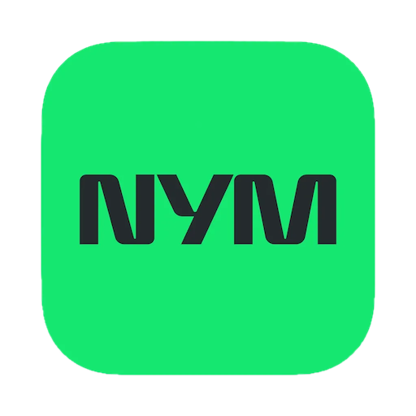

# Installing NymVPN with F-Droid
The NymVPN app is available for installation via [F-Droid](https://f-droid.org/), an alternative app store for Android. You have two options:

A. Access the latest stable apps via the main F-Droid repo (recommended)

B. Get early access to beta and preview apps via our private F-Droid repo (for advanced users)


## A.Installing NymVPN via the main F-Droid repo
In the F-Droid app, search for “NymVPN” and follow the app install instructions. Or visit [https://f-droid.org/en/packages/net.nymtech.nymvpn/](https://f-droid.org/en/packages/net.nymtech.nymvpn/).


## B.Installing NymVPN via our private F-Droid repo

### Apps

<!-- This table is auto-generated. Do not edit -->
| Icon | Name | Description | Version |
| --- | --- | --- | --- |
| <a href="https://github.com/nymtech/nym-vpn-client"></a> | [**NymVPN**](https://github.com/nymtech/nym-vpn-client) | Cross-platform open source VPN client built in Rust, with mixnet anonymity an... | v2.0.2 (20200) |
<!-- end apps table -->

### How to install Nym apps
1. In the app F-Droid app, navigate to Settings > Repositories and click the "+" floating action button.
2. To add the repository, click "SCAN QR CODE" and scan the QR code below or add the repository manually with the following URL:

    ```
    https://raw.githubusercontent.com/nymtech/fdroid/main/fdroid/repo?fingerprint=06C095C54BBFE147C986FD29ADF4E9BCD5E95ECACD6D865C6045B66B0B5500FB
    ```

    <p align="center">
      
    </p>


3. You can now install Nym apps, e.g. start by searching for "NymVPN" in the F-Droid client.

Please note that some apps published here might contain [Anti-Features](https://f-droid.org/en/docs/Anti-Features/). If you can't find an app by searching for it, you can go to settings and enable "Include anti-feature apps".

### [License](LICENSE)
The license is for the files in this repository, *except* those in the `fdroid` directory. These files *might* be licensed differently; you can use an F-Droid client to get the details for each app.
